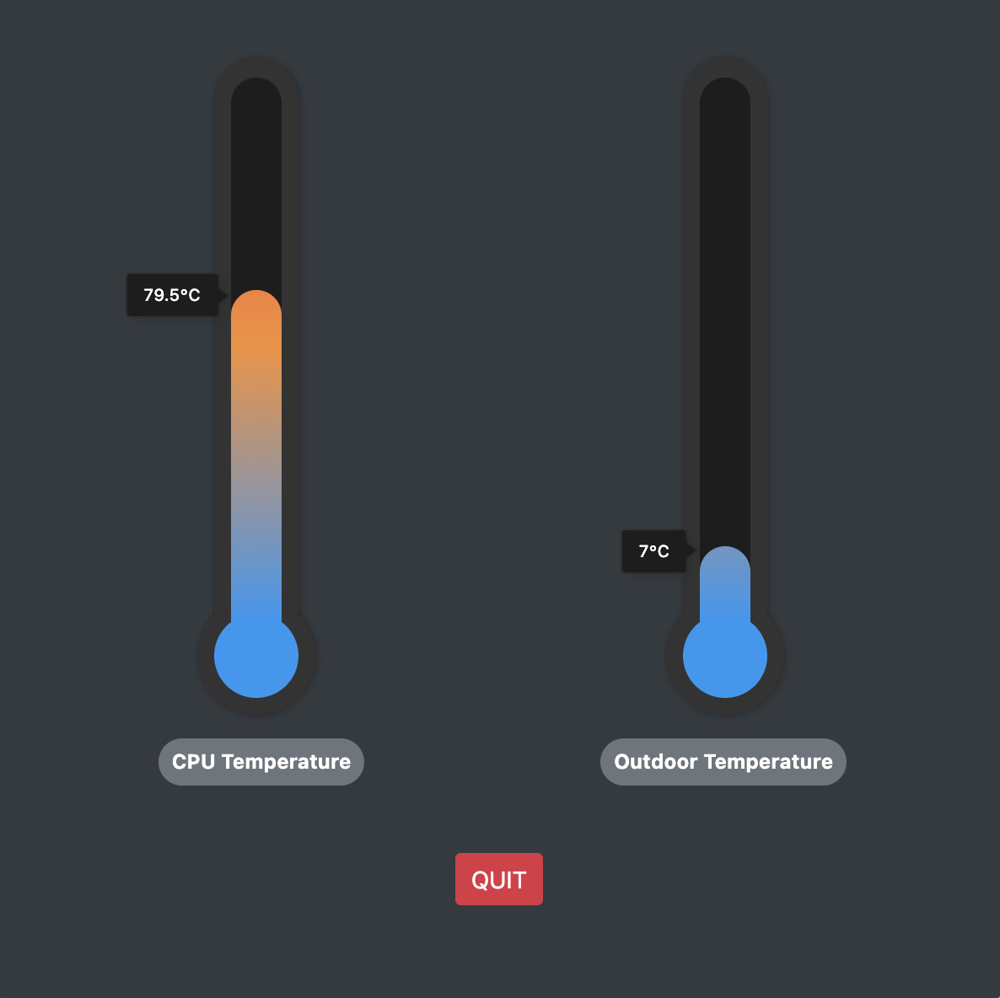

# Electron Device Temperature

`Note: This project is part of a interview test`

This electron app reads the current CPU temperature from the device is running on and also gets the outdoor temperature from a public weather API


## Development Setup

Clone the repository

OSX: `npm run dev-setup-osx`

Windows: `npm run dev-setup-win`

`npm start`
## Build releases

`npm run release`

Executables/Installers will be in `dist` folder.

---


```
current dev environment:

macOS Big Sur 11.2.1
Node v15.9.0
npm v7.5.3
```

---
```
TODO
- automatically get current location and pass it to weather API (currently grabs London temperature)
- on application start check for internet connection
- improve UX/UI
- advanced section with temperature for each CPU core
```